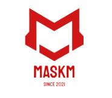

# MASKM-Store
MASKM os Full Stack App for buy products from different Sellers.\

App Build with Spring Framework in Back-End And React in Front-End 

1 Getting Started
```sh

These instructions will get you a copy of the project up and running on your local machine for development and testing purposes.
```



2 Prerequisites

```sh
2.1 Node

You can Download from this link : 
https://nodejs.org/en/download/

2.2 Java JDK
https://www.oracle.com/java/technologies/javase-downloads.html

2.3 Integrated development environment I suggest intellij or Eclipse for backend and WebStorm Or Visual Studio Code For the front-end . 

Download intellij:
https://www.jetbrains.com/idea/download/

Download Eclipse:
https://www.eclipse.org/downloads

Download Webstorm
https://www.jetbrains.com/webstorm/download/#section=windows

Download Visual studio code:
https://code.visualstudio.com/download

2.4 Database Management i suggest MySql . 

Download MySql:
https://www.mysql.com/downloads/

```


3 Installing


3.1 Install the required Prerequisites
```sh
1- Open MySql Software 

    Run this code SQL on Query :
 ```
```
sh 
    2- Import the back-end and go to src\main\resources\application.properties
-   In application.properties you should replace 
    spring.datasource.username=YOUR USERNAME
    spring.datasource.password=YOUR PASSWORD
-After that you can run the project 

3- - Import the front-end and run :
-   npm install     [for install all the requirement library ]
-   npm start     [for strat the project ]
-   

    
```
3.2 Some Account For Testing.

```sh

//				Admin Of Restaurant       => login :admin     Passwrod : admin   
                     And you can signup for check the client side.
```

4 Project Team

```sh
Milton Fredy Gonzalez Diaz :612356
Ahamad Elghannam :612398
Soufiane Ennali :612359
KARIM A R ABUREJILA :612403
Maher Samoudi :612382
```
